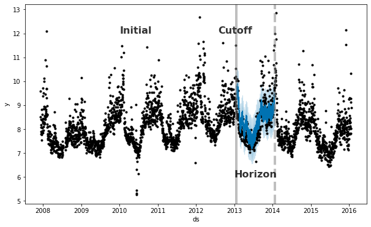

# Demo <!-- omit in toc -->

## Contents <!-- omit in toc -->

- [Setup Azure ML Studio](#setup-azure-ml-studio)
- [Data](#data)
  - [Preprocessing the Data](#preprocessing-the-data)
  - [Code explanation](#code-explanation)
- [Spot and treat outliers](#spot-and-treat-outliers)
- [Train a Prophet model](#train-a-prophet-model)
- [Model evaluation](#model-evaluation)
- [Hyperparameter tuning](#hyperparameter-tuning)
- [References](#references)
- [Agenda](#agenda)
  
## Setup Azure ML Studio


## Data

The data used for this Demo represents a car rental business. 
We wanted to predict the future trend for this rental business based on more than 10 years of experience and accumulated information.\
*Note: Due to privacy policies, data has been encrypted*


### Preprocessing the Data

To obtain the information we were interested in, we extracted the data about the rental of the vehicles.
More precisely, we extracted the data from *1995 to 2016*, for a grand total of *14.140.090 records*.

For each rental operation we have evidence of the station and the date at which the vehicle was rented and the station and Date at which the vehicle was returned.
Other information about the vehicle are also available, like the vehicle type, fuel type, transmission, bodyType, the engine power, etc.

|   |   StatIn |  StatOut |              DateIn |             DateOut | GroCode | FuelType | BodyType | VehicType | KW | CO2Emission | fTransmis | DoorsNum |
| - | -        | -        | -                   | -                   | -       | -        | -        | -         | -  | -           | -         | -        |
| 0 | 51898668 | 51898697 | 1995-03-21 18:16:00 | 1995-01-21 18:16:00 |       J |        G |      5DR |         1 | 66 |           1 |         S |      NaN |
| 1 | 51898593 | 51898593 | 1995-03-14 09:39:00 | 1995-02-12 09:40:00 |       J |        G |      5DR |         1 | 66 |           1 |         S |      NaN |
| 2 | 51898527 | 51898527 | 1995-03-16 15:30:00 | 1995-02-14 15:21:00 |       J |        G |      5DR |         1 | 66 |           1 |         S |      NaN |
| 3 | 51898094 | 51898094 | 1995-03-17 15:29:00 | 1995-02-15 15:30:00 |       H |        D |      5DR |         1 | 96 |           1 |         S |      NaN |
| 4 | 51898595 | 51898595 | 1995-03-19 15:30:00 | 1995-02-17 15:15:00 |       J |        G |      5DR |         1 | 66 |           1 |         S |      NaN |


As you may notice the data are neither precisely the ones we want, nor perfect.
For example the DoorsNum presents a lot of NaN values that may be a problem for us.
In order to clean and extract useful information from data, we have to preprocess it.

More precisely, *we want to know how many cars were in use each day*.

Due to the hugeness of the data we have and the complexity of the task we needed to accomplish, we needed the power of the cloud to obtain a result.
We loaded the data in an Azure Blob Storage and write a [python script](./src/preprocessing/occurrencies-by-day.ipynb) that would download the data from the storage, perform the data preprocessing, and write the result on the storage.


### Code explanation

The python script as first thing connects to the Azure Blob Storage where are stored the data and downloads the data file.

```py
from azureml.core import Workspace

ws = Workspace.from_config()

datastore = ws.get_default_datastore()
datastore.download("../Data/", prefix="CSV/")
```

Then it reads the downloaded csv and applies some filters to remove entries not of interest

```py
cols = ['DateIn', 'DateOut', 'GroCode']
path_to_data = "<path_to_data>"
data_sample = pd.read_csv(path_to_data, usecols=cols, date_parser=lambda x: parse_date(x), parse_dates=['DateOut', 'DateIn'], encoding="UTF-16 LE", sep=';', quotechar='"', error_bad_lines=False)
print("loaded", len(data_sample))

# Data before 2000 are not valuable, in any, remove cars returned before 2000
data_sample.drop(data_sample[data_sample.DateIn < datetime(2000, 1, 1)].index, inplace=True)
print("dropped datein before 2000-01-01", len(data_sample))

# Drop missing data
data_sample.dropna(inplace=True)
```

Finally, it start to work on cleaned data to extract the information of interest using. This step requires some time therefore, in order to speed up the process, you can consider to implement multithreading to parallelize the workload.

We defined an interval of dates to set the period of interest and created a dictionary where the keys will be the dates for each day in the interval and the value the number of vehicles *"in use"* that day. For each record, it increases the value in the dictionary for each day the vehicle was out with respect to the provided interval.

```py
mindate = data_sample['DateOut'].min()
maxdate = data_sample['DateIn'].max()

Occs_tot = {}

for _, row in data_sample.iterrows():
    if (row.DateOut >= mindate or row.DateOut < maxdate) and (row.DateOut < mindate or row.DateIn > mindate):
        tdelta = row.DateIn - row.DateOut
        group_code = row.GroCode

        if tdelta.days == 0:
            current_day = row.DateOut
            if current_day < maxdate and current_day >= mindate: 
                k = (group_code, current_day.strftime("%Y-%m-%d"))
                Occs_tot[k] = Occs_tot.setdefault(k, 0) + 1
            
        if tdelta.days > 0:
            for i in range(0, int(tdelta.days), 1):
                current_day = row.DateOut + timedelta(days=i)
                if current_day < maxdate and current_day >= mindate: 
                    k = (group_code, current_day.strftime("%Y-%m-%d"))
                    Occs_tot[k] = Occs_tot.setdefault(k, 0) + 1
    
# calculate occurrencies
occs = {}
for k in Occs_tot.keys():
    j = k[1]
    occs[j] = occs.setdefault(j, 0) + 1   
```

As result, we save the output as .csv for further analysis.

```py              
# output csv
path_to_sink = "<path_to_sink>"
output_file_name ="<output_file_name>"
dict_to_csv(output_file_name, path_to_sink, occs)
```

The output of the script is a row for each day in the interval of interest with the count of the vehicles that was out on that day.

| Date       | Count |
|-           | -     |
| 2000-01-01 | 6733  |
| 2000-01-02 | 7199  |
| 2000-01-03 | 7239  |
| 2000-01-04 | 7521  |
| 2000-01-05 | 8001  |


## Spot and treat outliers

In order to see what the data looks like, we plot the output and check his distribution.

```py
print(df.describe())
y = df.y
x = df.ds
plt.figure(figsize=(15,4))
plt.plot(x, y)
plt.xlabel('Date')  
plt.ylabel('Count')  

# displaying the title 
plt.title("Car by Day") 

plt.show()
```


As you can see from the boxplot below, there are some outliers we may better to get rid of.


In this case scenario, the best way to handle outliers is to remove them since Prophet has no problem with missing data. We use the same method used for building the boxplot; we calculate the IQR to identify the outliers and set their values to NA in the history.

```py
# calculate the IQ range for the outliers (out of the range ]Q1–1.5 * IRQ , Q3 + 1.5 * IQR[ )
Q1 = int(np.percentile(df.y, 25))
Q3 = int(np.percentile(df.y, 75))
IRQ = Q3 - Q1
lim_inf = Q1 - (1.5 * IRQ)
lim_sup = Q3 + (1.5 * IRQ)

# replace outliers with None
df.loc[(df.y < lim_inf) | (df.y > lim_sup), 'y'] = None
```


## Train a Prophet model

The main advantages of using Prophet are good performance, interpretability, and the ease of setup and use. 
To train a Prophet model, as first thing we need to parse the data and rename the columns to respect the prophet expectations

```py
df = pd.read_csv(path_to_data, date_parser=lambda x: parse_date(x), parse_dates=['Date'],
                encoding="UTF-8", sep=',', quotechar='"', error_bad_lines=False)

# rename Date and Count columns into ds and y as Prophet requires
df.rename(columns={'Date':'ds', 'Count':'y'}, inplace=True)
```

We proceed with the instantiation of the model and the fit (train) of it

```py
from fbprophet import Prophet
model = Prophet()
model_fit = model.fit(df)
```

We create a future dataframe of 12 months and use it to perform a prediction

```py
future = model.make_future_dataframe(periods=12, freq="M")
forecast = model.predict(future)
```

The result of the prediction (2016) is shown in the following picture togheter with the train data (2000-2015)


During the fit, Prophet tunes its components that it is useful to display; i.e. trend and seasonality (weekly, yearly)

```py
model.plot_components(forecast)
```


## Model evaluation

Finally we have to evaluate the model performances. To do so, we perform a Cross Validation on the model using the Prophet's Cross Validation module.

Prophet includes functionality for time series cross validation to measure forecast error using historical data.
This is done by selecting cutoff points in the history, and for each of them fitting the model using data only up to that cutoff point.
We can then compare the forecasted values to the actual values.
This figure illustrates a simulated historical forecast, where the model was fit to a initial history of 5 years, and a forecast was made on a one year horizon.



This cross validation procedure can be done automatically for a range of historical cutoffs using the cross_validation function.
We specify the forecast horizon (horizon), and then optionally the size of the initial training period (initial) and the spacing between cutoff dates (period).

We perform the cross validation on our model using an *initial* value of 10 year, a *period* of 180 days and an *horizon* of 180 days.

```py
from fbprophet.diagnostics import cross_validation
df_cv = cross_validation(model_fit, initial='3650 days', period='180 days', horizon='180 days')
```

Then we calculate the performance metrics and plot the results.

```py
from fbprophet.diagnostics import performance_metrics
df_p = performance_metrics(df_cv)
```

Plot the Mean Absolute Error (MAE)

```py
from fbprophet.plot import plot_cross_validation_metric
fig = plot_cross_validation_metric(df_cv, metric='mae')
```


Plot the Mean Absolute Percentage Error (MAPE)

```py
from fbprophet.plot import plot_cross_validation_metric
fig = plot_cross_validation_metric(df_cv, metric='mape')
```


Plot the Mean Squared Error (MSE)

```py
from fbprophet.plot import plot_cross_validation_metric
fig = plot_cross_validation_metric(df_cv, metric='mse')
```


Plot the Root Mean Squared Error (RMSE)

```py
from fbprophet.plot import plot_cross_validation_metric
fig = plot_cross_validation_metric(df_cv, metric='rmse')
```


## Hyperparameter tuning

We have trained the model using the default parameters. However, to increase the model performance, we can optimize the model by chosing a better set of parameters. 
The Prophet model has a number of input parameters that one might consider tuning.

This operation is computing expensive so we limited the number of parameters combination sets to four. 

```py
import itertools

param_grid = {  
    'seasonality_mode' : ['additive','multiplicative']
    ,'changepoint_range' : [0.8, 0.95]
}
# Generate all combinations of parameters
all_params = [dict(zip(param_grid.keys(), v)) for v in itertools.product(*param_grid.values())]
```

  seasonality_mode: Options are ['additive', 'multiplicative']. Default is 'additive', but many   business time series will have multiplicative seasonality. This is best identified just from  looking at the time series and seeing if the magnitude of seasonal fluctuations grows with the   magnitude of the time series

  changepoint_range: This is the proportion of the history in which the trend is allowed to change.   This defaults to 0.8, 80% of the history, meaning the model will not fit any trend changes in the   last 20% of the time series. This parameter is probably better not tuned, except perhaps over a   large number of time series. In that setting, [0.8, 0.95] may be a reasonable range

Once the model has been trained using each set, we retrive the combination of parameters that have had the best performance over all and use it for our model.

```py
args_metrics = {
        "initial" : '3650 days' 
        ,"period" : '180 days'
        ,"horizon" : '30 days'
    }

rmses = []  # Store the RMSEs for each params here
mapes = [] # Store the MAPEs for each params here

# Use cross validation to evaluate all parameters
for params in all_params:
    m = Prophet(**params).fit(df)  # Fit model with given params
    df_cv = cross_validation(m, **args_metrics)
    df_p = performance_metrics(df_cv, rolling_window=1)
    rmses.append(df_p['rmse'].values[0])
    mapes.append(df_p['mape'].values[0])
    
# Find the best parameters set
tuning_results = pd.DataFrame(all_params)
tuning_results['rmse'] = rmses
tuning_results['mape'] = mapes

best_params = all_params[np.argmin(mapes)]
print(best_params)
```

## Hyperparameter tuning

We have trained the model using the default parameters. However, to increase the model performance, we can optimize the model by chosing a better set of parameters. 
The Prophet model has a number of input parameters that one might consider tuning.

This operation is computing expensive so we limited the number of parameters combination sets to four. 

```py
import itertools

param_grid = {  
    'seasonality_mode' : ['additive','multiplicative']
    ,'changepoint_range' : [0.8, 0.95]
}
# Generate all combinations of parameters
all_params = [dict(zip(param_grid.keys(), v)) for v in itertools.product(*param_grid.values())]
```

  seasonality_mode: Options are ['additive', 'multiplicative']. Default is 'additive', but many   business time series will have multiplicative seasonality. This is best identified just from  looking at the time series and seeing if the magnitude of seasonal fluctuations grows with the   magnitude of the time series

  changepoint_range: This is the proportion of the history in which the trend is allowed to change.   This defaults to 0.8, 80% of the history, meaning the model will not fit any trend changes in the   last 20% of the time series. This parameter is probably better not tuned, except perhaps over a   large number of time series. In that setting, [0.8, 0.95] may be a reasonable range

Once the model has been trained using each set, we retrive the combination of parameters that have had the best performance over all and use it for our model.

```py
args_metrics = {
        "initial" : '3650 days' 
        ,"period" : '180 days'
        ,"horizon" : '30 days'
    }

rmses = []  # Store the RMSEs for each params here
mapes = [] # Store the MAPEs for each params here

# Use cross validation to evaluate all parameters
for params in all_params:
    m = Prophet(**params).fit(df)  # Fit model with given params
    df_cv = cross_validation(m, **args_metrics)
    df_p = performance_metrics(df_cv, rolling_window=1)
    rmses.append(df_p['rmse'].values[0])
    mapes.append(df_p['mape'].values[0])
    
# Find the best parameters set
tuning_results = pd.DataFrame(all_params)
tuning_results['rmse'] = rmses
tuning_results['mape'] = mapes

best_params = all_params[np.argmin(mapes)]
print(best_params)
```


## References
- Data
  - [https://azure.microsoft.com/en-us/services/container-instances/](https://azure.microsoft.com/en-us/services/container-instances/)
- Train the Prophet model and prediction of the trend
  - [https://facebook.github.io/prophet/](https://facebook.github.io/prophet/)
  - [https://github.com/facebook/prophet](https://github.com/facebook/prophet)
- Test the Prophet model
  - [https://facebook.github.io/prophet/docs/diagnostics.html](https://facebook.github.io/prophet/docs/diagnostics.html)
- Other examples with Prophet
  - [https://github.com/facebook/prophet/blob/master/notebooks/](https://github.com/facebook/prophet/blob/master/notebooks/)


## Agenda
1. [Presentation](./01.presentation.md) :clock1030: **(10:30)**
2. [Introduction](02.introduction.md) **(10:45)**
3. [Azure Machine Learning Studio](03.azure-machine-learning-studio.md) :clock1130: **(11:30)**
4. [Demo](04.demo.md) :clock12: **(12:00)**
5. **[Where to go next](05.where-to-go-next.md)** **(12:20)**
6. [Q&A](06.q&a.md) **(12:25)**