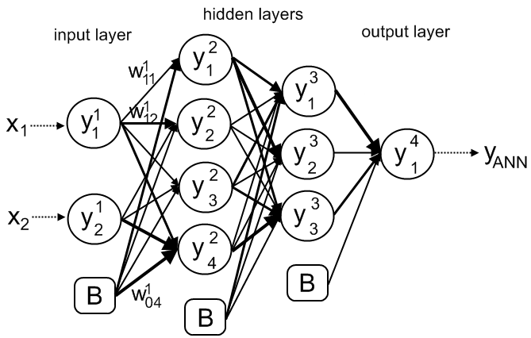
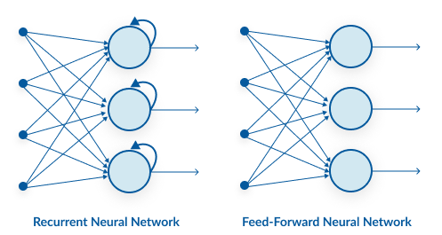

# Where to go next <!-- omit in toc -->

## Contents <!-- omit in toc -->

- [Artificial Neural Networks](#artificial-neural-networks)
  - [Deep Learning](#deep-learning)
  - [Frameworks for deep learning](#frameworks-for-deep-learning)
    - [Tensorflow](#tensorflow)
    - [Keras](#keras)
    - [PyTorch](#pytorch)
  - [Types of Neural Network](#types-of-neural-network)
    - [NeuralProphet](#neuralprophet)
- [References](#references)
- [Agenda](#agenda)

## Artificial Neural Networks

Artificial Neural networks are a set of algorithms, modeled loosely after the human brain, that are designed to recognize patterns. They interpret sensory data through a kind of machine perception, labeling or clustering raw input. The patterns they recognize are numerical, contained in vectors, into which all real-world data, be it images, sound, text or time series, must be translated.

### Deep Learning

Deep learning is the name we use for “stacked neural networks”; that is, networks composed of several layers.

The layers are made of nodes. A node is just a place where computation happens, loosely patterned on a neuron in the human brain, which fires when it encounters sufficient stimuli. A node combines input from the data with a set of coefficients, or weights, that either amplify or dampen that input, thereby assigning significance to inputs with regard to the task the algorithm is trying to learn; e.g. which input is most helpful is classifying data without error? These input-weight products are summed and then the sum is passed through a node’s so-called activation function, to determine whether and to what extent that signal should progress further through the network to affect the ultimate outcome, say, an act of classification. If the signals passes through, the neuron has been “activated.”

Here’s a diagram of what one node might look like.

*node diagram*

A node layer is a row of those neuron-like switches that turn on or off as the input is fed through the net. Each layer’s output is simultaneously the subsequent layer’s input, starting from an initial input layer receiving your data.

*node connenctions*

Pairing the model’s adjustable weights with input features is how we assign significance to those features with regard to how the neural network classifies and clusters input.

### Frameworks for deep learning
#### Tensorflow

TensorFlow is an end-to-end open source platform for machine learning. TensorFlow is a rich system for managing all aspects of a machine learning system.

TensorFlow APIs are arranged hierarchically, with the high-level APIs built on the low-level APIs. Machine learning researchers use the low-level APIs to create and explore new machine learning algorithms.

<!--The following figure shows the hierarchy of TensorFlow toolkits:

*TensorFlow toolkit hierarchy*-->

#### Keras

Keras is a high-level neural networks API, written in Python and capable of running on top of TensorFlow, CNTK, or Theano. It was developed with a focus on enabling fast experimentation. Being able to go from idea to result with the least possible delay is key to doing good research.

Use Keras if you need a deep learning library that:

- Allows for easy and fast prototyping (through user friendliness, modularity, and extensibility).
- Supports both convolutional networks and recurrent networks, as well as combinations of the two.
- Runs seamlessly on CPU and GPU.

Why use Keras? Keras prioritizes developer experience

- Keras is an API designed for human beings, not machines. Keras follows best practices for reducing cognitive load: it offers consistent & simple APIs, it minimizes the number of user actions required for common use cases, and it provides clear and actionable feedback upon user error.
- This makes Keras easy to learn and easy to use. As a Keras user, you are more productive, allowing you to try more ideas than your competition, faster -- which in turn helps you win machine learning competitions.
- This ease of use does not come at the cost of reduced flexibility: because Keras integrates with lower-level deep learning languages (in particular TensorFlow), it enables you to implement anything you could have built in the base language. In particular, as tf.keras, the Keras API integrates seamlessly with your TensorFlow workflows.

#### PyTorch

PyTorch is a library for Python programs that facilitates building deep learning projects. PyTorch emphasizes flexibility and allows deep learning models to be expressed in idiomatic Python.
In a simple sentence, think about Numpy, but with strong GPU acceleration. Better yet, PyTorch supports dynamic computation graphs that allow you to change how the network behaves on the fly, unlike static graphs that are used in frameworks such as Tensorflow.

Why PyTorch?
- Developed by Facebook
- NumPy-like arrays on GPU’s
- Dynamic computational graphs

### Types of Neural Network

There are many types of Neural Network but, for the purpose of this section, we quote only three important types of neural networks that form the basis for most pre-trained models in deep learning:

- Artificial Neural Networks (ANN)
    ANN is also known as a *Feed-Forward Neural network* because inputs are processed only in the forward direction.
    ANN can be used to solve problems related to:
      - Tabular data
      - Image data
      - Text data
- Convolution Neural Networks (CNN)
    They’re especially prevalent in image and video processing projects.
- **Recurrent Neural Networks (RNN)**
    RNN has a recurrent connection on the hidden state. This looping constraint ensures that sequential information is captured in the input data.

    

    RNN can be used to solve the problems related to:
      - Time Series data
      - Text data
      - Audio data
      - 
#### NeuralProphet

Time series very rarely (if at all) follow a single pattern over extended periods of time. In general, NNs can map any nonlinear function to approximate any continuous function, so they will do their best to fit and approximate the given data.
The main advantages of using Prophet are good performance, interpretability, and the ease of setup and use. That is what the authors of NeuralProphet also had in mind for their library — to retain all the advantages of Prophet, while improving its accuracy and scalability by introducing an improved backend (**PyTorch** instead of Stan) and using an Auto-Regressive Network (**AR-Net**) to combine the scalability of Neural Networks with the interpretability of the AR models. To summarize the AR-Net in one sentence — it is a single layer network that is trained to mimic the AR process in a time series signal, but at a much larger scale than the traditional models.
Thankfully, the API of NeuralProphet is close to identical to the original Prophet. This way, knowing our way around from the previous example will make it really easy to apply NeuralProphet to the time series forecasting task.

## References

- [https://pathmind.com/wiki/neural-network](https://pathmind.com/wiki/neural-network)
- [https://towardsdatascience.com/the-mostly-complete-chart-of-neural-networks-explained-3fb6f2367464](https://towardsdatascience.com/the-mostly-complete-chart-of-neural-networks-explained-3fb6f2367464)
- [https://www.tensorflow.org/](https://www.tensorflow.org/)
- [https://developers.google.com/machine-learning/crash-course/first-steps-with-tensorflow/toolkit](https://developers.google.com/machine-learning/crash-course/first-steps-with-tensorflow/toolkit)
- [https://keras.io/](https://keras.io/)
- [https://pytorch.org/](https://pytorch.org/)
- [https://towardsdatascience.com/what-is-pytorch-a84e4559f0e3](https://towardsdatascience.com/what-is-pytorch-a84e4559f0e3)
- [https://github.com/ourownstory/neural_prophet](https://github.com/ourownstory/neural_prophet)

## Agenda
1. [Presentation](./01.presentation.md) :clock1030: **(10:30)**
2. [Introduction](02.introduction.md) **(10:45)**
3. [Azure Machine Learning Studio](03.azure-machine-learning-studio.md) :clock1130: **(11:30)**
4. [Demo](04.demo.md) :clock12: **(12:00)**
5. [Where to go next](05.where-to-go-next.md) **(12:20)**
6. **[Q&A](06.q&a.md)** **(12:25)**