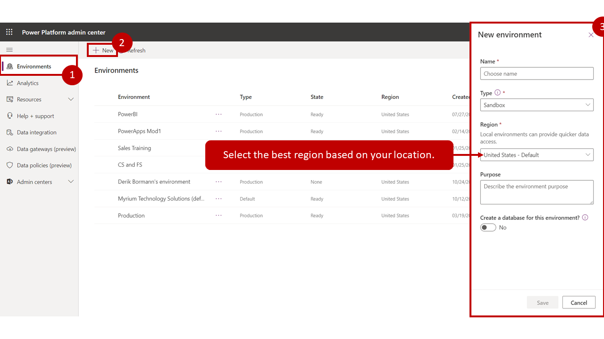

# Introduction  <!-- omit in TOC -->

## Contents <!-- omit in TOC -->

- [POWER PLATFROM INTRODUCTION](#power-platfrom-introduction)
  - [Features](#features)
- [WHAT IS POWER VIRTUAL AGENT](#what-is-power-virtual-agent)
  - [Highlights of Power Virtual Agents](#highlights-of-power-virtual-agents)
- [INTRODUCTION TO ENVIRONMENTS](#introduction-to-environments)
  - [Create environments](#create-environments)
- [POWER VIRTUAL AGENTS COMPONENTS](#power-virtual-agents-components)
  - [Topics](#topics)
  - [Use system and sample topics](#use-system-and-sample-topics)
  - [Entities](#entities)
  - [Prebuilt entities](#prebuilt-entities)
  - [Custom entities](#custom-entities)
- [Agenda](#agenda)

## POWER PLATFROM INTRODUCTION

Microsoft Power Platform is comprised of four key products: Power Apps, Power Automate, Power BI and Power Virtual Agents.

**Power Apps**  provides a rapid low code development environment for building custom apps for business needs. It has services, connectors, and a scalable data service and app platform (Microsoft Dataverse) to allow simple integration and interaction with existing data. Power Apps enables the creation of web and mobile applications that run on all devices.
 People use apps for every area of their lives, and business should be no exception. Most out of the box solutions do not meet exact business needs or integrate well with other business programs. Power Apps eases users into app development with a simple interface so that every business user or pro developer can build custom apps.

**Power Automate**  lets users create automated workflows between applications and services. It helps automate repetitive business processes such as communication, data collections, and decision approvals.
 Don&#39;t waste important productive hours on drafting the same email for a weekly update or walking approvals through. Not only for the individual user, Power Automate allows for the creation of enterprise-grade process automation. Power Automate&#39;s simple interface allows every level of user to automate work tasks - from beginners to seasoned developers.

**Power BI**  (Business Intelligence) is a business analytics service that delivers insights for analyzing data. It can share those insights through data visualizations which make up reports and dashboards to enable fast, informed decisions. Power BI scales across an organization, and it has built-in governance and security allowing businesses to focus on using data more than managing it.
 You can consider Power BI as the analysis and insights leg of Microsoft Power Platform. It takes business data and allows you to display it in ways that makes the most sense to users. A Power BI dashboard could potentially replace a standing meeting to report out on company metrics such as sales data, progress against goals, or employee performance.

**Power Virtual Agents**  enables anyone to create powerful chatbots using a guided, no-code graphical interface, without the need for data scientists or developers.
 It minimizes the IT effort required to deploy and maintain a custom solution by empowering subject matter experts to build and maintain their own conversational solutions. Power Virtual Agents is part of Microsoft Power Platform, therefore integration into existing systems is streamlined with out-of-the-box integration with Power Automate and its ecosystems of hundreds of connectors. Users can enable chatbots to perform an action by simply calling a Power Automate flow. Flows help users automate activities or call back end systems. Users can utilize existing flows that have been created in their Power Apps environment or they can create a flow within Power Virtual Agents authoring canvas.

### Features

Among the programs listed above, there are cross cutting features which enable Microsoft Power Platform to be leveraged to its full potential. Some of these are:

**AI Builder**  lets users and developers add AI capabilities to the workflows and Power Apps they create and use. AI Builder is a turnkey solution that allows you to easily add intelligence to your workflows and apps and predict outcomes to help improve business performance without writing code.

**Microsoft Dataverse**  is a scalable data service and app platform which lets users securely store and manage data from multiple sources and integrate that data in business applications using a common data model to ensure ease and consistency to users. Microsoft Dataverse is the common currency that enables the components of Microsoft Power Platform to work together. It&#39;s the foundation that enables the consolidation, display, and manipulation of data.

**Connectors**  enable you to connect apps, data, and devices in the cloud. Consider connectors the bridge across which information and commands travel. There are more than 275 connectors for Microsoft Power Platform, enabling all of your data and actions to connect cohesively. Examples of popular connectors include Salesforce, Office 365, Twitter, Dropbox, Google services, and more.

Although every feature is essential to building powerful solutions, let&#39;s dive in deeper to one of the features of Microsoft Power Platform, connectors.

## WHAT IS POWER VIRTUAL AGENT

Power Virtual Agents empowers teams to easily create powerful chatbots using a guided, no-code graphical interface without the need for data scientists or developers. Power Virtual Agents addresses many of the major issues with bot building in the industry today. It eliminates the gap between the subject matter experts and the development teams building the bots, and the long latency between teams recognizing an issue and updating the bot to address it. It removes the complexity of exposing teams to the nuances of conversational AI and the need to write complex code. Also, it minimizes the IT effort required to deploy and maintain a custom conversational solution.

Using Power Virtual Agents, you can:

- **Empower your teams**  by allowing them to easily build chatbots themselves without needing intermediaries, coding, or AI expertise.
- **Reduce costs**  by easily automating common inquiries and freeing human agent time to deal with more complex issues.
- **Improve customer satisfaction**  by allowing customers to self-help and resolve issues quickly, 24/7 using rich personalized bot conversations.

### Highlights of Power Virtual Agents

1. **Get started in seconds**. Power Virtual Agents is a software-as-a-service (SaaS) offering. It allows you to easily sign up, create your chatbot, and embed it into your website with just a few clicks. There is no infrastructure to maintain or complex systems to deploy.
2. **Empower your subject matter experts**. Using Power Virtual Agents, you are in the driver&#39;s seat. Your SMEs can create chatbots quickly and easily using a  **novel, intuitive, code-free graphical interface** , eliminating the need for AI expertise or teams of developers.
3. **Enable rich, natural conversations.**  Microsoft&#39;s powerful conversational AI capabilities enable your end users to have rich multi-turn conversations that quickly guide them to the right solution. And, unlike most products on the market, there is no need to retrain AI models. Simply provide a few short examples of the topic you want the chatbot to handle, build the conversation using the graphical editor, and your chatbot is ready to handle customer requests. You can even try out your changes in real-time in the test pane!
4. **Enable chatbots to take action.**  Chatbots that can chat with your users are great, but chatbots that can act on their behalf are even better. With Power Virtual Agents, you can easily integrate with services and back-end systems out-of-the-box or through hundreds of easy-to-add custom connectors using Power Automate. This makes it simple to create a chatbot that not only responds to the user, but also acts on their behalf.
5. **Monitor and improve chatbot performance.**  Power Virtual Agents lets you keep an eye on how your chatbots are performing using powerful metrics and AI-driven dashboards. Easily see which topics are doing well and where the chatbot can improve, and quickly make adjustments to improve performance.
6. **Better together.**  Power Virtual Agents works hand-in-hand with Dynamics 365 Customer Service Insights to provide a holistic view of your customer service operations. You can use Customer Service Insights and Power Virtual Agents together to determine which topics are trending or consuming support resources, and then easily automate them.

## INTRODUCTION TO ENVIRONMENTS

Today, many organizations have a global presence and provide service to customers in multiple regions, countries, or continents. This aspect can result in needing different types of interactions based on factors such as different data being available and resolutions that are based on departments or locations. Your organization might need to deploy similar bots in different regions that interact with systems and data for those areas. Power Virtual Agents accommodates this occurrence by letting you create bots in different environments and switch between them.

Environments represent space to store, manage, and share your organization&#39;s business data. Each bot that you create is stored in an environment. Items like model-driven and canvas applications and Power Automate flows are also stored in environments. Each environment might have different roles, security requirements, and target audiences. Individual environments are not created in Power Virtual Agents; they are created in a separate location. After you have created an individual environment, Power Virtual Agents bots can be created in that environment.

Depending on business needs, organizations can use environments in many ways, including:

- **Departmental**  - By creating an environment that corresponds with specific organizational teams or departments, created bots will contain relevant information for that audience.
- **Locational**  - Because the displayed data might be different based on geographic regions, you might define separate environments for different global branches of your company.

You only need multiple environments if your company is global and you are supporting regions with specific data privacy and storage requirements like China, Germany, the EU, Singapore, and so on. In that case, you will need to establish environments for each region as you would for any other service that uses and stores data for customers in that region.

### Create environments

The first time that you sign in to Power Virtual Agents and create a new bot, a default environment is created. Unless specified otherwise, any additional bots will be created in the default environment. If additional environments are needed, such as for different regions, organizational needs, or other circumstances, they can be added through the Microsoft Power Platform admin center.

When in the admin center, you can add environments by going to the  **Environments**  tab and selecting  **New**  to open the new environment panel.

For each environment, you will need to provide the following information:

- **Name**  - A unique name for the environment.
- **Environment**  - Defines the type of environment to create, such as production, trial, or sandbox.
- **Region**  - Defines the support data region where the environment will be created.

*From https://docs.microsoft.com/it-it/learn/modules/power-virtual-agents-bots/media/power-virtual-agents-2-1-ssm.png#lightbox*

If you want to have a Microsoft Dataverse database created for the environment to use entities like accounts, contacts, and other business-related data, you can set the  **Create a database for this environment**  field to  **Yes**. Additionally, you should select  **Yes**  if you are using Power Virtual Agents in conjunction with other Dynamics 365 applications. Data from Dataverse can be used in bots to provide tailored customer experiences. After the Dataverse database has been created, new bots can be deployed to the environment from the Power Virtual Agents portal.

## POWER VIRTUAL AGENTS COMPONENTS

When you create chatbots with Power Virtual Agents, you author and edit topics. Topics are discrete conversation paths that, when used together within a single chatbot, allow for users to have a conversation with a chatbot that feels natural and flows appropriately. Creating a chatbot with Power Virtual Agents is easy to do with the no-code authoring canvas, and there are a number of ways you can manage how topics interact, how you want the conversation to flow, and what it should feel like. It is also easy to test the chatbot without having to fully deploy the chatbot whenever you make a small change. There are also lesson topics that guide you through topic authoring - from simple to complex scenarios, as well as default system topics. You can also choose what language you want your chatbot to use.

### Topics

In Power Virtual Agents, a topic defines how a chatbot conversation plays out. You can author topics by customizing provided templates, create new topics from scratch, or get suggestions from existing help sites.

A topic has trigger phrases—these are phrases, keywords, or questions that a user is likely to type that is related to a specific issue—and conversation nodes—these are what you use to define how a chatbot should respond and what it should do.

The AI uses natural language understanding to parse what a customer actually types and find the most appropriate trigger phrase or node.

For example, a user might type &quot;Open hours&quot; into your chatbot—the AI will be able to match that to the  **Store hours**  topic and begin a conversation that asks which store the customer is interested in, and then display the hours the store is open.

You can see how the chatbot conversation works in practice by testing it in the  **Test chatbot**  pane. This lets you fine-tune the topic until you are ready to deploy it without having to exit the Power Virtual Agents portal.

### Use system and sample topics

When you create a chatbot, a number of topics will be automatically created for you.

These are:

- Four prepopulated  **User Topics**  that are titled as lessons. These lesson topics can be used to help understand simple to complex ways of using nodes to create chatbot conversations.
- A number of  **System Topics**. These are prepopulated topics that you are likely to need during a chatbot conversation. We recommend you keep these and use them until you are comfortable with creating an end-to-end chatbot conversation.

You can edit both of these topic types in the same manner as for topics you create; however, you cannot delete them.

### Entities

A big part of chatbot conversations in Power Virtual Agents is natural language understanding, which is the ability for the AI to understand a user&#39;s intent. For example, natural language understanding is involved when a user might say &quot;I tried to use my gift card but it doesn&#39;t work&quot; and the chatbot is able to route the user to the topic related to gift cards not working—even if that exact phrase isn&#39;t listed as a trigger phrase.

One fundamental aspect of natural language understanding is to identify _entities_ in a user dialog. An entity can be viewed as an information unit that represents a certain type of a real-world subject, like a phone number, zip code, city, or even a person&#39;s name.

### Prebuilt entities

Out of the box, Power Virtual Agents comes with a set of prebuilt entities, which represent the most commonly used information in real-world dialogs, such as age, colors, numbers, and names.

With the knowledge granted by entities, a chatbot can smartly recognize the relevant information from a user input and save it for later use.

### Custom entities

The prebuilt entities cover commonly used information types, but on some occasions, such as when building a chatbot that serves a specific purpose, you will need to teach the chatbot&#39;s language understanding model some domain-specific knowledge.

## Agenda

1. [Presentation](01.presentation.md) 
2. **[Introduction](02.introduction.md)**
3. [Create your First Bot](02.introduction.md) 
4. [Q&A](08.q&a.md) 