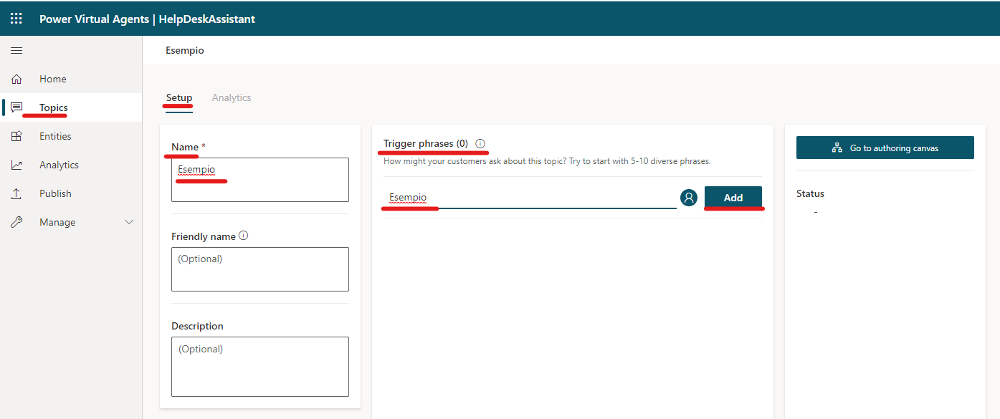
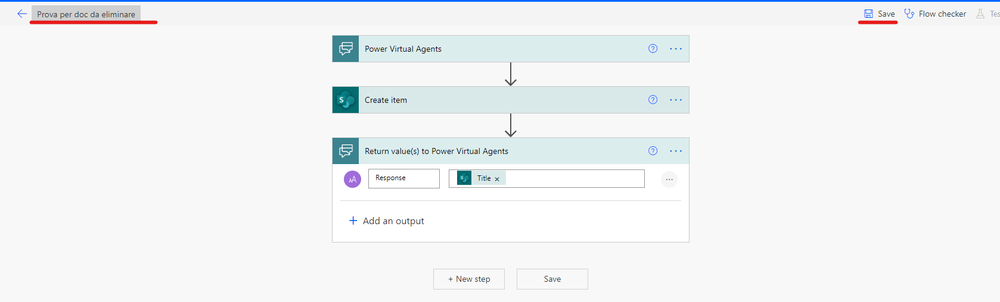
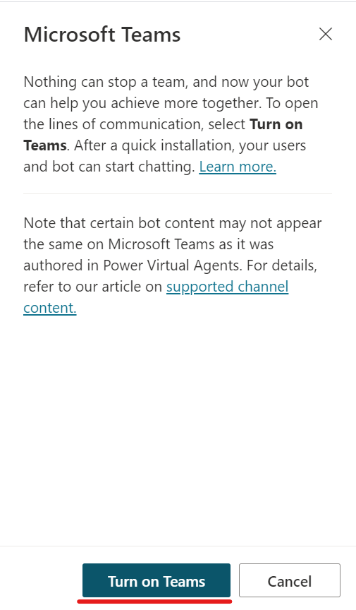
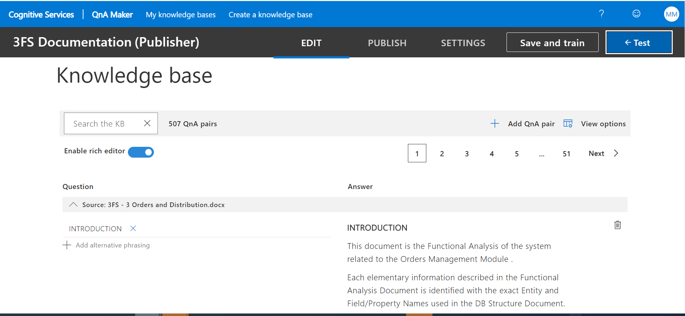

# Introduction  <!-- omit in TOC -->

## Contents <!-- omit in TOC -->

- [CREATE YOUR FIRST BOT](#create-your-first-bot)
- [CREATE AND MANAGE TOPICS](#create-and-manage-topics)
- [ACTIONS AVAILABLE IN PVA](#actions-available-in-pva)
  - [ASK A QUESTION](#ask-a-question)
  - [ADD A CONDITION](#add-a-condition)
  - [CALL AN ACTION](#call-an-action)
  - [SHOW A MESSAGE](#show-a-message)
  - [GO TO ANOTHER TOPIC](#go-to-another-topic)
  - [END THE CONVERSATION](#end-the-conversation)
- [TEST YOUR BOT](#test-your-bot)
- [PUBLISH THE BOT](#publish-the-bot)
- [INTEGRATE THE BOT IN A DEMO WEBSITE](#integrate-the-bot-in-a-demo-website)
- [INTEGRATE THE BOT IN MICROSOFT TEAMS](#integrate-the-bot-in-microsoft-teams)
- [INTEGRATE A COGNITIVE SERVICE (QNA MAKER) IN A PVA CHATBOT](#integrate-a-cognitive-service-qna-maker-in-a-pva-chatbot)
  - [ADD A NEW QUESTION AND ANSWER SET](#add-a-new-question-and-answer-set)
  - [SAVE AND TRAIN](#save-and-train)
- [TEST THE KNOWLEDGE BASE](#test-the-knowledge-base)
- [To test the already created KB, follow these steps:](#to-test-the-already-created-kb-follow-these-steps)
- [PUBLISH THE KNOWLEDGE BASE](#publish-the-knowledge-base)
  - [HOW TO INTEGRATE A KNOWLEDGE BASE FROM QNA MAKER TO POWER VIRTUAL AGENT BOT](#how-to-integrate-a-knowledge-base-from-qna-maker-to-power-virtual-agent-bot)

## CREATE YOUR FIRST BOT

Before you start creating bots, it is important to consider what the bot will be used for. For example, you might use the bot to handle account inquiries, or you could use it for self-service support cases such as knowledge base access. Knowing how you plan to use the bot will help you define and plot out conversation paths and determine how many topics the bot will handle.

Once you have in mind this, it&#39;s time to create the Bot.

In order to create a Bot on Power Virtual Agent, follow these steps:

1. Go to [https://powerva.microsoft.com/](https://powerva.microsoft.com/)
2. Click on the Bot icon on the right side of the page:
3. Chose the environment where the Bot will be created and click on the &quot;New Bot&quot; button

1. On the window that appear, chose a name for the Bot, select the language and check that the environment is the right one. Then click the &quot;Create&quot; button.

1. Wait for few minutes and the Bot is created

## CREATE AND MANAGE TOPICS

In order to create a new topic on Power Virtual Agent follow these steps:

1. Click on the Bot icon on the right side of the screen and ensure the Bot you are working on is the right one:

1. Click on &quot;Topics&quot; on the left side of the screen:

1. Click on &quot;New Topic&quot;:

1. On the Setup window, give a name to the topic and add as many &quot;trigger phrases&quot; as you prefer.

Trigger phrases represent all the phrases that the user can type when chatting with a Bot to activate a specific Topic and execute all the actions built on that topic.

1. Once added all the trigger phrases, click on &quot;Go to authoring canvas&quot; on the right side of the screen:

1. Once on the authoring canvas, here you can start to build all the actions the Bot should perform once activated. In order to build these actions, under the trigger phrases box, click on the &quot;+&quot; sign to add a node:

1. Choose the action you want to build by selecting one of the actions listed:

## ACTIONS AVAILABLE IN PVA

When you are authoring a specific topic, there all several type of actions you can add to build the Bot behavior.

Here you find a list of all of them:

1. Ask a question
2. Add a condition
3. Call an action
4. Show a message
5. Go to another topic
6. End the conversation

### ASK A QUESTION

This action let you type a specific question to the user and offers different possibilities on how to ask it by specifying the &quot;Identify&quot;.

Following a short guide of how to do it and the different identify possibilities:

1. Go to https://web.powerva.microsoft.com/
2. Click on &quot;Topics&quot; in the menù on the left side of the screen:

1. Choose a topic where add the action or create a new topic:

1. Click on &quot;Go to authoring canvas&quot;:

1. Click on the plus sign (add a node):

1. Click on &quot;Ask a question&quot;:

1. Type the question:

1. Select the identify you prefer from the ones listed

1. Click on the pen icon to edit the name of the variable in which you will save the response of the user:

1. Give a name to the variable and decide if you want to make it available also in other topics or limit the scope to the topic you are working on clicking on one of the two options in the &quot;usage&quot; section

1. Save the topic by clicking on the save button on the upper right side of the screen

### ADD A CONDITION

This action will let you to specify the action the Bot should perform depending if the condition is satisfied or not.

Usually the condition is automatically built by Power Virtual Agent when you choose to use the &quot;ask a question&quot; action with the &quot;multiple choices&quot; option according to the different choices.

Following a short guide of how to do it and the different identify possibilities:

1. Go to https://web.powerva.microsoft.com/
2. Click on &quot;Topics&quot; in the menù on the left side of the screen:

1. Choose a topic where add the action or create a new topic:

1. Click on &quot;Go to authoring canvas&quot;:

1. Click on the plus sign (add a node):

1. Click on &quot;Ask a question&quot;:

1. Type the question, choose the &quot;multiple choices&quot; identify and type the different choices:

1. Click on the pen icon to edit the name of the variable in which you will save the response of the user:

1. Give a name to the variable and decide if you want to make it available also in other topics or limit the scope to the topic you are working on clicking on one of the two options in the &quot;usage&quot; section

1. Once added the options for the user, Power Virtual Agent will automatically build the conditions based on the name of the city variable. As you can see, in the condition box you will find the name of the variable (you can change the variable you want to use), the condition statement that determines the expression of which the condition is based on (you can change it as you prefer) and finally the option chosen by the user.

1. By clicking on the plus sign (add a node) you can define the next action the Bot should perform if the condition is satisfied:

### CALL AN ACTION

This action will let you to create or add a Power Automate flow to the Bot which will perform a series of actions based on what you need.

It is usually used to integrate different technologies such as SharePoint, QnA Maker, LUIS etc. to the PVA Bot.

Following a short guide of how to do it and the different identify possibilities:

1. Go to https://web.powerva.microsoft.com/
2. Click on &quot;Topics&quot; in the menù on the left side of the screen:

1. Choose a topic where add the action or create a new topic:

1. Click on &quot;Go to authoring canvas&quot;:

1. Click on the plus sign (add a node):

1. Click on &quot;Call an action&quot;:

1. If you have already created your flow, you will find it in the list of available flows. You need just to click on its name.

1. Once added, if required, select the variable from which the flow will take the input as trigger

1. If the flow is not yet created, you can create a new one by clicking on &quot;Create a flow&quot;

1. You will be redirected in the Power Automate page with a Power Virtual Agent flow template

1. Click on &quot;Add an input&quot; to add the input from PVA as flow&#39;s trigger

1. Choose the input type you are interested in from the ones showed

1. Click on the plus sign to insert a new step to perform some actions.

1. In this case we have added a Sharepoint &quot;Create item&quot; action

1. Add an output to return it on Power Virtual Agent

1. Choose the output&#39;s types to return from the ones showed

1. In this case we have decided to return the &quot;Title&quot; from the Sharepoint item just created

1. Rename the flow and then click on the &quot;save&quot; button

1. Once saved, come back on PVA page and click on the flow just created

### SHOW A MESSAGE

This action will let you to create a message that the Bot will show to the user.

It is usually used to communicate something to the user

Following a short guide of how to do it and the different identify possibilities:

1. Go to https://web.powerva.microsoft.com/
2. Click on &quot;Topics&quot; in the menù on the left side of the screen:

1. Choose a topic where add the action or create a new topic:

1. Click on &quot;Go to authoring canvas&quot;:

1. Click on the plus sign (add a node):

1. Click on &quot;Show a message&quot;:

1. Type the message you want to show to the user

1. You can also insert a variable to the message by clicking on the {x} and choosing the variable you are interested in from the ones listed

1. You can also modify the layout of the message by clicking on the different options available as showed:

### GO TO ANOTHER TOPIC

This action will let you to jump between topics.

It is usually used when specific actions that the Bot should perform are contained in other topics (created by you or system topics).

Following a short guide of how to do it and the different identify possibilities:

1. Go to https://web.powerva.microsoft.com/
2. Click on &quot;Topics&quot; in the menù on the left side of the screen:

1. Choose a topic where add the action or create a new topic:

1. Click on &quot;Go to authoring canvas&quot;:

1. Click on the plus sign (add a node):

1. Click on &quot;Go to another topic&quot;:

1. Choose the topic you are interested in from the ones listed and click on it:

1. Once clicked, it will be represented as following:

### END THE CONVERSATION

This action will let you to end the conversation with the user in two ways:

1. **With a survey**
2. **Transfer to an agent**

Ending the conversation with a survey will let you to collect the user experience.

Ending the conversation with the transfer to an agent is used when probably the Bot is not capable to run a user&#39;s need and you want to send the request to a live agent.

Following a short guide of how to do it and the different identify possibilities:

1. Go to https://web.powerva.microsoft.com/
2. Click on &quot;Topics&quot; in the menù on the left side of the screen:

1. Choose a topic where add the action or create a new topic:

1. Click on &quot;Go to authoring canvas&quot;:

1. Click on the plus sign (add a node):

1. Click on &quot;end the conversation&quot;:

1. Choose between the two options available

1. In case you choose to end with a survey, it will be showed as following:

1. In case you choose to &quot;transfer to an agent&quot;, you will be able to specify a message that recap the user need so that the live agent will have all the info required

## TEST YOUR BOT

Because a bot is made up of multiple topics, it is important to ensure that each topic is working appropriately and can be interacted with as intended. You can test your bot in real time by using the test bot panel, which you can enable by selecting Test your bot at the bottom of the side navigation pane. When the panel displays, the button name changes to Hide your bot so that you can hide it if more space is needed during the design process.

In order to do so, follow these simple three steps:

1. Click on &quot;Test your bot&quot; button on the left bottom side of the screen:

1. Type a phrase or a word and check if the Bot is performing as expected:

1. If it is not performing well, check the topic that is not working and adjust it till it works as expected

By testing your bots often throughout the creation process, you can ensure that the conversation flows as anticipated. If the dialog does not reflect your intention, you can change the dialog and save it. The latest content will be pushed into the test bot, and you can try it out again.

## PUBLISH THE BOT

After your bot content has been created, it needs to be published so that customers can engage with it. Published bots can be made available across multiple platforms and channels. Before a bot can be added to channels, interacted with, or used by team members, it will need to be published at least once.

Publishing bots as you make changes also ensures that customers are engaging with the latest bot content. When you are ready to publish your bot, select the  **Publish**  tab on the side navigation pane. During the publishing process, the bot will be checked for errors. Bot publishing typically takes a few minutes. When the publish is successful, the top of the page will display a green banner indicating that everything worked correctly. If errors are detected, you will be notified through a message that is displayed in the application.

Here a short guide on how to do it:

1. Click on the &quot;Publish&quot; section on the Menu on the left side of the screen:

1. On the appearing screen, click on the &quot;Publish&quot; button:

1. On the appearing window, click again on the &quot;Publish&quot; button:

1. Once published, you will be noticed with a green bar at the top of the page:

## INTEGRATE THE BOT IN A DEMO WEBSITE

Before the bot is deployed to the different channels that use it, you might want to gain feedback from other team members. When a bot is first published, it can be made available to the demo website. You can provide the demo website&#39;s URL to team members or stakeholders to try it out. The advantage of using the demo website is that the experience is different than testing the bot during the design process. Because the test bot experience is only intended to allow bot authors to test it, the demo website link increases the pool of users that can test and provide feedback that is related to the overall experience of the bot.

To add a bot to the demo website, select the demo website link under Share your bot. This webpage demonstrates what your bot looks like to a user who comes to your webpage. The bot canvas is at the bottom. You can interact with it by entering text in the window or by selecting a starter phrase from the provided options.

## INTEGRATE THE BOT IN MICROSOFT TEAMS

Power Virtual Agent Chatbots can be easily integrated in other Microsoft applications like Microsoft Teams or third-party applications like Facebook, Slack etc.

Here a short guide on how to integrate the Bot in Microsoft Teams:

1. Click on the &quot;Manage&quot; section on the Menu on the left side of the screen:

1. Click on &quot;Channels&quot;

1. Select &quot;Microsoft Teams&quot;:

1. On the appearing window, click on the &quot;Turn on Teams&quot; button

1. Now you will be able to use your Bot on Microsoft Teams.
 Keep in mind that with this operation only you will be able to use the Bot in Teams.
 In the next steps you will see how to find and use it.

1. Go on Microsoft Teams application
2. Click on the three dots on the left side of the screen:

1. You will be able to find it in the recent apps. If not, type the name in the search box and then click on the application:

1. Use the Chatbot:

1. In order to make the Bot available to all the Organization&#39;s users, in the step 10 click on the &quot;Submit for admin approval&quot; button and wait for the administrator approval:

1. Once approved, go on Microsoft Teams
1. Click on the &quot;Apps&quot; button on the left side of the screen
1. Type the name of the ChatBot in the search box
1. Once find it, click on it
1. Click on the &quot;Add&quot; button

## INTEGRATE A COGNITIVE SERVICE (QNA MAKER) IN A PVA CHATBOT

In order to create a Knowledge Base on QnA Maker service, follow these steps:

1. Go to the QnA Maker service clicking on this link: [https://www.qnamaker.ai/](https://www.qnamaker.ai/)

1. Click on Create a Knowledge Base

1. On the  **Create**  page, skip  **Step 1**  if you already have your QnA Maker resource.

If you haven&#39;t created the resource yet, select  **Create a QnA service**. You are directed to the [Azure portal](https://ms.portal.azure.com/#create/Microsoft.CognitiveServicesQnAMaker) to set up a QnA Maker service in your subscription. Remember your Azure Active Directory ID, Subscription, QnA resource name you selected when you created the resource.

1. When you are done creating the resource in the Azure portal, return to the QnA Maker portal, refresh the browser page, and continue to  **Step 2** selecting your Active directory, subscription, service (resource), and the language for all knowledge bases created in the service.

1. In Step 3, name your knowledge base

1. In Step 4, add a URL or a file (which represent the Knowledge Base you want to refer to) and set the Chit-chat as you prefer

1. In Step 5, click on Select Create your KB.

The extraction process takes a few moments to read the document and identify questions and answers.

After QnA Maker successfully creates the knowledge base, the Knowledge base page opens. You can edit the contents of the knowledge base on this page.

### ADD A NEW QUESTION AND ANSWER SET

In order to add new questions and answers on the Knowledge Base, follow these steps:

1. In the QnA Maker portal, on the Edit page, select + Add QnA pair from the context toolbar.
2. Add a question as the following example:

How many Azure services are used by a knowledge base?

1. Add the answer formatted with markdown as the following example:

\* Azure QnA Maker service\n\* Azure Cognitive Search\n\* Azure web app\n\* Azure app plan

The markdown symbol, \*, is used for bullet points. The \n is used for a new line.

The Edit page shows the markdown. When you use the Test panel later, you will see the markdown displayed properly.

### SAVE AND TRAIN

In the upper right, select Save and train to save your edits and train QnA Maker. Edits aren&#39;t kept unless they&#39;re saved.

## TEST THE KNOWLEDGE BASE

## To test the already created KB, follow these steps:

1. In the QnA Maker portal, in the upper right, select  **Test**  to test that the changes you made took effect.
2. Enter an example user query in the textbox.
3. Select  **Inspect**  to examine the response in more detail. The test window is used to test your changes to the knowledge base before publishing your knowledge base.
4. Select  **Test**  again to close the  **Test**  panel.

## PUBLISH THE KNOWLEDGE BASE

When you publish a knowledge base, the contents of your knowledge base move from the test index to a prod index in Azure search.

In the QnA Maker portal, select Publish. Then to confirm, select Publish on the page.

The QnA Maker service is now successfully published. You can use the endpoint in your application or bot code.

### HOW TO INTEGRATE A KNOWLEDGE BASE FROM QNA MAKER TO POWER VIRTUAL AGENT BOT

Once published, it is now the time to integrate the Knowledge Base to a Power Virtual Agent Bot.

Here a short guide on how to do it:

1. Go back to the PVA Chatbot page
2. Click on Settings (gear icon on the upper right side of the screen):

1. Click on System fallback:

1. On the appearing window, click on Add

1. Once added, click on Go to fallback topic

1. On the fallback topic, click on Go to authoring canvas:

1. Click on the plus sign

1. Click on &quot;Call an action&quot; and then on &quot;Create a flow&quot;

1. Click on Templates and leave this page

1. Look for &quot;QnA&quot; and select the template showed &quot; **Generate answer using QnA Maker knowledge base from Power Virtual Agent&quot;**

1. Establish the connection with QnA passing the parameter asked in the following image.

The name of the connection can be chosen as you prefer. The two remaining info can be taken on the QnA Service as described in the next step.

1. On the QnA service, go to the &quot;settings&quot; of the Knowledge Base&quot;. Copy the info underlined in red and paste it to Power Automate QnA connection and click create

1. On the flow that appear, insert the parameter on the &quot;Generate Answer&quot; block. On the next step will be showed the info to insert

1. On the QnA service, always on the setting page, copy the info underlined in red and paste them on the previous step:

15) Once inserted the info, rename the flow and save it

1. Click on Solution on the left side of the screen and then click on &quot;New Solution&quot;

1. Give a name to the solution and select a Publisher. Then select &quot;Create&quot;

1. Select the solution just created, click on the three dot and then click on edit

1. Click on &quot;Add existing&quot; and then click on &quot;Cloud Flow&quot;

1. Look for the flow previously created on the Outside Solution, select it and then click on Add

1. Once added to the solution, go back to the Power Virtual Agent Fallback topic, click again on &quot;Call an action&quot; and then select the flow created:

1. As input text, select &quot;UnrecognizedTriggerPhrase&quot;:

1. On the message, select the &quot;Final Answer&quot; variable and save the topic. It will show the answer taken from the QnA Knowledge Base.

