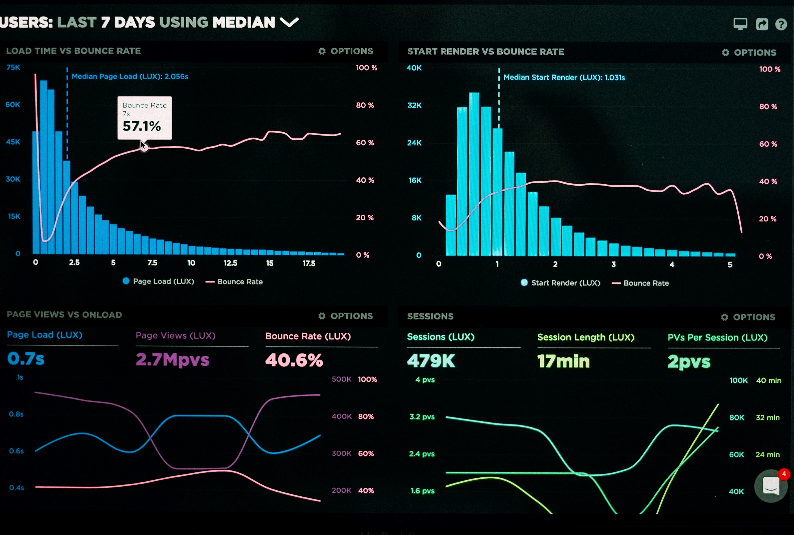
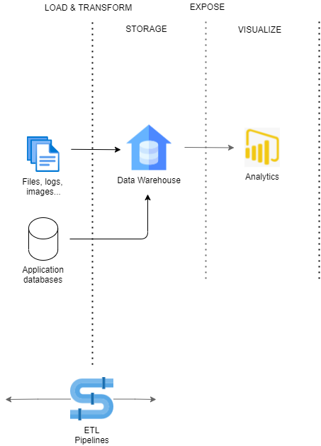
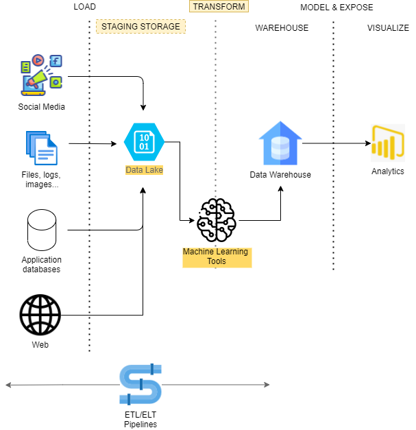
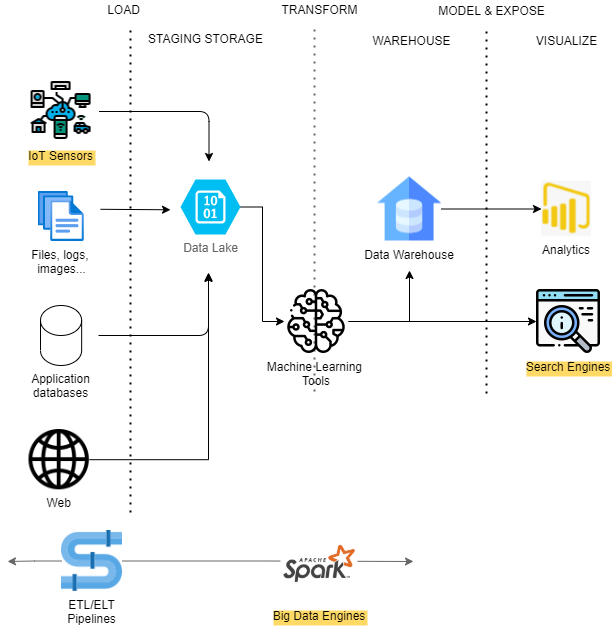

<link rel="stylesheet" href="style.css">

# Introduction  <!-- omit in TOC -->

## Contents <!-- omit in TOC -->

- [Data ingestion and analytics](#data-ingestion-and-analytics)
  - [Data Ingestion challenges](#data-ingestion-challenges)
- [Traditional Architecture](#traditional-architecture)
  - [Data Warehouse](#data-warehouse)
  - [ETL](#etl)
  - [Analytical tools](#analytical-tools)
- [Modern components](#modern-components)
  - [Data Lake](#data-lake)
  - [Machine Learning](#machine-learning)
  - [Other: IoT, Spark, Search Engines](#other-iot-spark-search-engines)
- [Agenda](#agenda)

## Data ingestion and analytics

Modern IT architectures have data coming from a lot of different sources, including application databases, social media interactions, user reviews, external partners.

The opportunity given by the possibility to analyze these data to make analysis and take decisions, from immediate actions to longest business plans, is huge. Some examples:
- Medical infrastructures: 
  - general patient records with diseases, drugs bought in pharmacy, hospital data...
  - Possible analysis: efficiency of drugs, increment of diseases in a given area...
- Sales information from companies: 
  - sales data, inventory, calls and chat exchanges with support, reviews with photos, social media interactions...
  - Possible analysis: main complains from customers, detect real-time issues with products...
- Airports and transport hubs: 
  - tickets from companies, sensor on the number of travelers in different areas, sales data of shops, highways congestion
  - Possible analysis: points of congestion, move employees to other areas

*From: Luke Chesser*

### Data Ingestion challenges

However, efficiently retrieving and transforming them to make them exploitable for analysis poses many challenges:
- Different formats: textual, images, audios, data with complex and heterogeneous structures, often changing along time
- Data must be retrieved from external applications or databases, posing several issues: security aspects, need for efficient connection, availability
- Huge volumes of data must be stored in a secure place
- External data may not be always easily available, and quality and veracity of data must be analyzed (e.g: fake reviews)

These challenges must be faced with complex solutions involving Data Ingestion and Analytical tools. These solutions are sometimes called *Business Intelligence* solution, or *Big Data* architectures according to the volume of data from the sources.

## Traditional Architecture

A typical architecture for a traditional data ingestion process is composed of several components.

*Icons from flaticons.com*

### Data Warehouse

Storage containing data retrieven from different applications, unified, simplified and adapted to the analysis need.

Divided in different *data mart*, each representing a *business process* (e.g.: sales, inventory, orders). Each data mart provides:
- Facts: measures that we want to provide (e.g: number of sales, total earnings) 
- Dimensions: order date, product categories, warehouse location

### ETL
Process for retrieving data from external sources and load into a Data Warehouse
- *Extract* from external source
- *Transform* into target model (Data Warehouse model in this case)
- *Load* in target storage

ETL processes can operate in two ways:
- Batch: schedule the ETL process regularly (once in an hour, day or week). 
- Streaming: when real-time data are needed. The ETL process runs continously. 

ETL processes can be implemented with an *ad-hoc* code, most commonly there are tools that allow defining ETL processes (or *pipelines*) with simple graphical interfaces. We will see in next chapters how to implement an ETL pipeline with some Microsoft cloud tools in Azure.

### Analytical tools
Tools used to present data retrieved in the data ingestion process.
Concretely, analytical tools offer several functions:
- Dashboards with several plots and indicators
- Alerts: e-mail, chat messages, notifications
- Automatic corrective actions

Some well-known analytical tool are Tableau, PowerBI, even Excel can be considered as one.

## Modern components

Current architecture often varies from traditional ones, taking into account modern challenges and opportunities.

*Icons from flaticons.com*

### Data Lake

A simple storage tool, typically similar to a classical "File System", that collects all data from external sources in any format they are, without the need to *transform* them. 

In this way, if Data Warehouse model is changed or additional fields must be retrieved, data can be taken from Data Lake without the need to extract them again from the source, where they also might have been deleted. 

In this case, ETL processes can be called ELT, as load is made before transformations.

### Machine Learning

ML tools are more and more often used to enrich data retrieved from external tools.
We saw some of these tools on former lessons on ML and cognitive services.
Ideas:
- Analyse time series of sales to predict future sales and detect anomalies
- Use photos to detect category of a product in e-commerce
- Analyse reviews to detect positive and negative sentiments

### Other: IoT, Spark, Search Engines

- Data ingestion tools are often used in the context of **IoT tools**. E.g: sensors sending temperatures, movements, photos...
- [**Spark**](https://spark.apache.org/) and other Big Data tools such as Hadoop are often used, typically when large quantities of data need to be analyzed in real-time or almost real time. They are optimized for making in-memory analysis in a cluster of machines working in parallel
- Search Engines like SolR or [**ElasticSearch**](https://www.elastic.co/) are often used as alternative or additional storage, typically when full-text search are needed (e.g: logs).

*Icons from flaticons.com*

## Agenda

1. [Presentation](01.presentation.md) :clock12: **(00:00)**
2. **[Introduction](02.introduction.md)**
3. [Azure and microsoft resources](03.azure-microsoft-resources.md) :clock1230: **(00:30)**
4. [Azure Synapse](04.azure-synapse.md) :clock1: **(01:00)**
5. [Q&A](08.q&a.md) :clock2: **(02:00)**