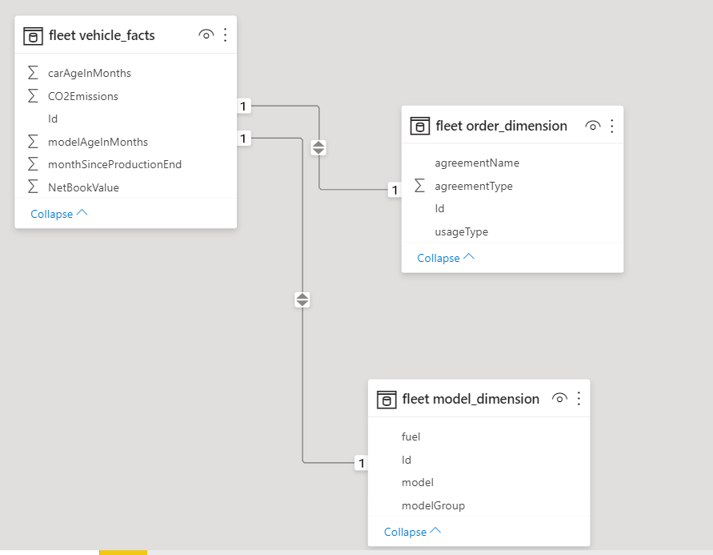

# Azure and Microsoft Resources  <!-- omit in TOC -->

## Contents <!-- omit in TOC -->

- [Azure Resources for Data Ingestion and Analytics](#azure-resources-for-data-ingestion-and-analytics)
  - [Azure SQL Database](#azure-sql-database)
  - [Azure Data Factory](#azure-data-factory)
  - [Azure Data Lake Storage](#azure-data-lake-storage)
  - [PowerBI](#powerbi)
- [Azure Synapse](#azure-synapse)
- [Additional Azure Resources](#additional-azure-resources)
- [References](#references)
- [Agenda](#agenda)

## Azure Resources for Data Ingestion and Analytics

Azure provides several useful resources for creating a Data Ingestion pipeline.

A traditional pipeline in Azure/PowerBI is composed of the following components:

- ETL pipelines implemented with Azure Data Factory,
- Azure Data Lake Storage Gen2,
- Azure SQL Database as Data Warehouse,
- PowerBI as an Analytical tool.

Azure Analysis Services is a component that is often added to this pipeline, while this is not strictly necessary. 
It allows to pre-calculated some metrics from data in Data Warehouse and keep the results in-memory, so they can be quickly and efficiently added to the PowerBI dashboards. We won't go into details of Analysis Services in this course.

### Azure SQL Database

A traditional relational database, used of operational systems, can also be used as a Data Warehouse.

### Azure Data Factory

Data Factory is a tool to develop ETL pipelines, allowing to integrate and transform data from several sources, with more than 90 connectors.
It is completely managed and serverless, so users don't have to worry about creating, configuring and maintaining containers or virtual machines.

It allows defining complex pipelines and activating triggers for launching them.
The "Data Flow" option also gives the possibility to create complex no-code transformation (join, filtering, projection...) and it is based on a Spark Engine.

Data Factory can connect to Cloud or external data sources, and even to REST APIs and other services.

With the *Self-hosted integration runtime*, an instance of Data Factory can be launched on-premises, this is particularly useful when having a large quantity of on-premises data.

Azure Data Factory configuration can be easily versioned using GIT, using the Data Factory studio.

*From https://docs.microsoft.com/it-it/azure/data-factory/author-visually*

### Azure Data Lake Storage

Azure provide a resource to create a Data Lake, called Data Lake Storage Gen2.

It stores data in form of files, structured in nested directories like classical file systems.

A Data lake typically contains different data, from audio to images to structured data. The most common format used in Data Lake for metadata are simple CSV files, or Parquet files, a compressed column-based format more efficient and less consuming than CSV. Data can also be provided in form of JSON or CSV. 

### PowerBI

PowerBI is a tool to create Dashboards from external data.
Potentially it can retrieve data from different sources (Excel files, Databases...).

Indeed, for small projects it can be directly attached to operational databases. However, for a complex project it is always better to create an architecture with a Data Lake / Data Warehouse, and attach PowerBI to the Data Warehouse.

Once data are retrieven from a source, they can be shown in a tabular model, and relations between tables can be added by the user.

When tabular model is available, Dashboard pages can be created, adding plots, tables and text, providing for each component which column(s) to use.

## Azure Synapse

Synapse is a tool for Data Ingestion and Analytics that has been recently added to Azure. It allows to configure in a single studio the ETL pipelines, replacing Data Factory (the pipelines and interface are very similar) and the Data Warehouse, also allowing navigation in the Data Lake in its own interface.

More details will be provided later in this course.

While Azure Synapse is more expensive compared to a traditional architecture, it has a unique interface and has high performances on big databases. 

- :heavy_plus_sign: Unique interface for ETL pipeline designing and running, Data Lake management, connection to Analytics 
- :heavy_plus_sign: High-performance analytics
- :heavy_minus_sign: More expensive, especially for smaller (< 1 TB) Databases

## Additional Azure Resources

There are several Azure resources that are often used to enrich the Data Ingestion pipeline, according to the user needs.

- **Logic Apps**: A no-code tool that allows to create Batch processes. E.g:  when a file is added to a given directory, for instance a CV, add an entry to a database and send a notification e-mail.
- **Azure Functions**: An Azure function is simply a function coded as a REST Endpoint. Azure provides libraries to code it in a simple way. It can be useful to do complex analysis or as an adapter to connect to external systems.
- **Cognitive Services, Azure Machine Learning**: often Machine Learning tools are used to enrich Data Ingestion pipelines. In previous lessons we presented the Cognitive Services resources and the Azure Machine Learning Studio.
- **Azure Databricks**: data analysis and transform tool based on Apache Spark. Typically used when complex analysis (e.g. Machine Learning) on large quantities of data are required. Unlike Data Factory, it does not provide a graphical interface but it requires writing codes with Jupyer notebooks.

We provide in the references some pointers for other interesting resources not covered in this course.

## References

Data Ingestion pipeline:
- https://docs.microsoft.com/en-us/azure/architecture/reference-architectures/data/enterprise-bi-adf
- https://docs.microsoft.com/en-us/azure/data-factory/
- https://docs.microsoft.com/en-us/azure/storage/blobs/data-lake-storage-introduction
- https://aka.ms/synapse

PowerBI:
- https://docs.microsoft.com/it-it/power-bi/

Other tools:
- https://docs.microsoft.com/en-us/azure/logic-apps/
- https://docs.microsoft.com/en-us/azure/azure-functions/
- https://docs.microsoft.com/en-us/azure/databricks/

Real time processing:
- https://docs.microsoft.com/en-us/azure/stream-analytics/
- https://docs.microsoft.com/en-us/azure/event-hubs/

Internet of Things:
- https://docs.microsoft.com/en-us/azure/iot-hub/
- https://docs.microsoft.com/en-us/azure/iot-edge/

## Agenda

1. [Presentation](01.presentation.md) :clock12: **(00:00)**
2. [Introduction](02.introduction.md)
3. **[Azure and microsoft resources](03.azure-microsoft-resources.md) :clock1230: (00:30)**
4. [Azure Synapse](04.azure-synapse.md) :clock1: **(01:00)**
5. [Q&A](08.q&a.md) :clock2: **(02:00)**