# Azure Synapse  <!-- omit in TOC -->

## Contents <!-- omit in TOC -->

- [General information](#general-information)
- [Demo](#demo)
  - [Create resources on Azure](#create-resources-on-azure)
  - [Create connection to external Database and a Serverless SQL Pool](#create-connection-to-external-database-and-a-serverless-sql-pool)
  - [Create a Power BI workspace and connect Synapse to it](#create-a-power-bi-workspace-and-connect-synapse-to-it)
  - [Create ETL Pipelines to import data](#create-etl-pipelines-to-import-data)
  - [Add trigger for the pipeline](#add-trigger-for-the-pipeline)
  - [Generate PowerBI Dashboards](#generate-powerbi-dashboards)
- [Agenda](#agenda)

## General information

Synapse Studio is an integrated Azure tool that allows managing all the steps of an Analytics pipeline, within a single interface.
In particular:
- It integrates a tool for designing ETL pipelines, [very similar to Azure Data Factory](https://docs.microsoft.com/en-us/azure/synapse-analytics/data-integration/concepts-data-factory-differences), with a graphical interface to create pipelines
- It allows from its interface to query and navigate the data in an Azure Data Lake Storage
- It is possible to create:
  - a dedicated Relational Database (Dedicated SQL Pool)
  - a Serverless SQL Pool, i.e. an SQL Engine containing only views (or External Tables) on the Data Lake
- It allows from its interface to connect data to a PowerBI instance and see a preview of the Dashboards
- It is possible to activate a Spark Engine with Synapse, and define Spark transformations using Jupyer Notebooks.

All the configuration and objects created within Synapse can be versioned with a Git repository.

## Demo

### Create resources on Azure

1. Create a resource group for your project
2. Open resource group, select Add --> MarketPlace --> Azure Synapse Analytics (**not private hubs**) --> Create
3. On the current screen, click on account name --> create new and select a name, same for file system name

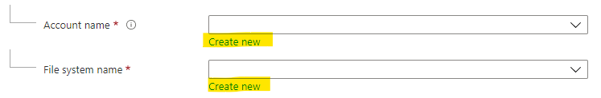

4. Add the remaining configuration for Synapse workspace as in the screenshot

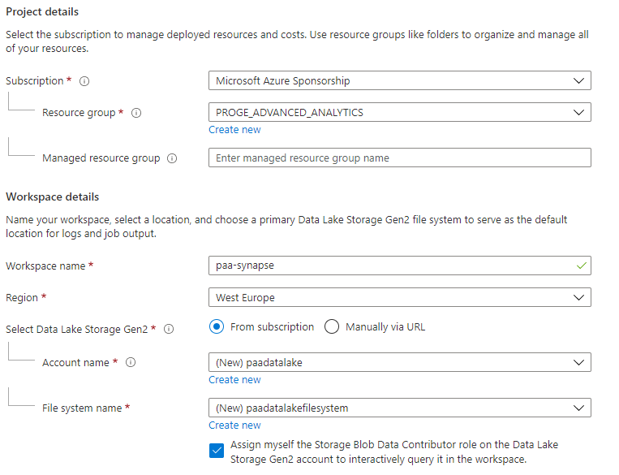

5. Click on review and create, then on Create

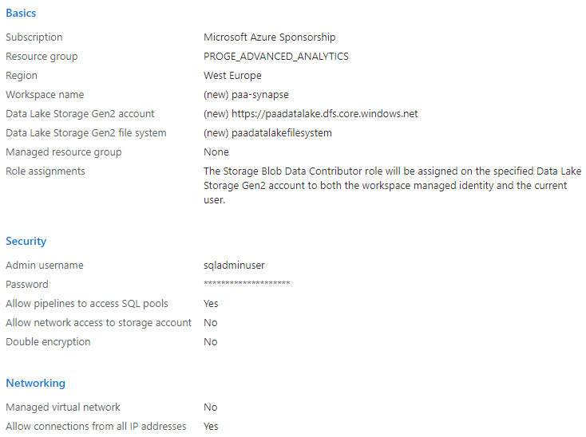
 
### Create connection to external Database and a Serverless SQL Pool

1. Open the resource group of the project
2. Open Synapse Workspace
3. Click on *Open Synapse Studio*
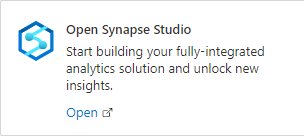

NB: Synapse allows you to version all the configurations in a GIT Repository. We won't go into details here, but you can switch between "Synapse Live" (no versioning) to a versioning in GIT in the upper left corner of the screen.

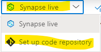

4. Click on Manage --> Linked Services --> New

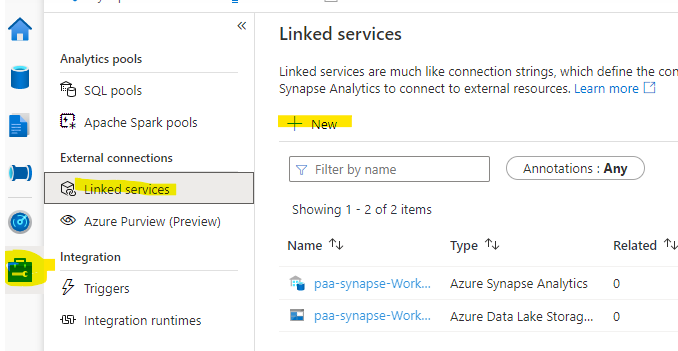

5. Select *Azure SQL Database* and click on continue
6. Provide the required information.  

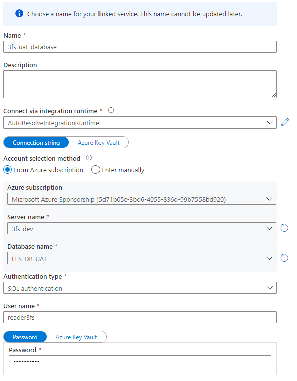

7. Click on test connection on the bottom of the page to make sure connection is successful, then click on create.

8. Click on the "Data" icon on the left, then on the "+" and SQL Database.

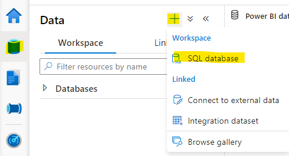

9. Select "Serverless" and provide a name

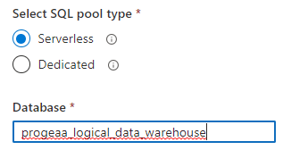

### Create a Power BI workspace and connect Synapse to it

1. Open [powerbi.com](https://app.powerbi.com/home)
2. Login with your own company account 
3. Click on workspaces --> Create a Workspace

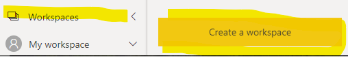

4. Provide name and description and click on save

5. Go back to Synapse, click on Manage --> Linked services --> New

6. Select Connect to Power BI or search for Power BI
7. Provide a name for the linked service and the workspace name you have just created in Power BI, then click on Create

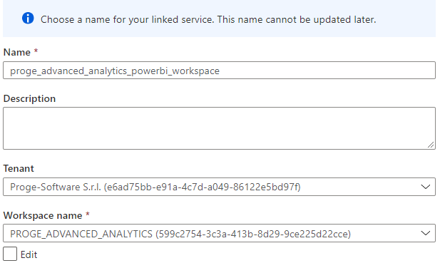

8. Click on Publish All to validate all modifications 

### Create ETL Pipelines to import data

**The subsequent step must be executed for each business process you want to analyze, with facts and dimensions**

1. Click on the Storage sign on the left ("Data"), then on the linked tab and on the primary data lake object as in the figure. Then, click on "New folder" to create a new folder with the name of your business process.

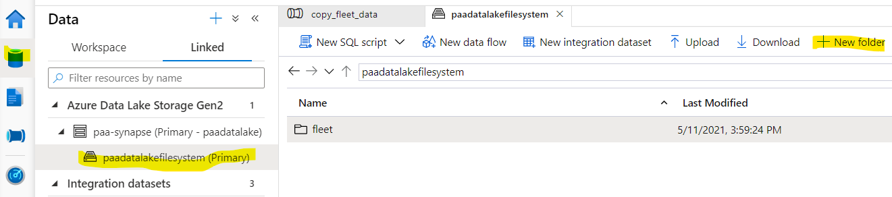

2. Click on "integrate" button on the left 

3. Click on the plus "+" button on the right of "integrate", then select "Pipeline"

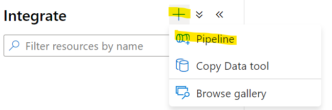

4. Provide a name for the pipeline

**The subsequent step must be repeated for each table you want to create in the Data Lake**

5. On the left bar, expand "Move and Transform" and select "Copy data" tool
 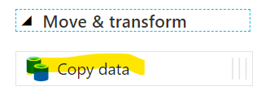

6. Provide a name for the step, like copy_[table_name]
7. Click on the source tab and apply the following steps: 
   * click on "+ New" button on the right of "Source Dataset"
   * Choose Azure SQL Database as input (or your source DB)
   *  Fulfill the properties form with a name and the linked service we created for the external database, select the table (or "None" if you want to import via a query and not the full table), then click on OK.

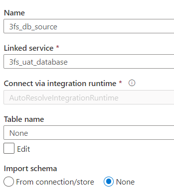

   * The source dataset you just create should appear on the dropdown list, otherwise select it. Fulfill the rest of the source with the query (or table) of your choice.

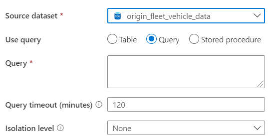

8. Go the the sink tab, click on "+ New" on the right of "Sink dataset" 
9. Select "Azure Data lake storage Gen2", then "Parquet"
10. In the subsequent form, provide a name and select the workspace default storage as linked service. 

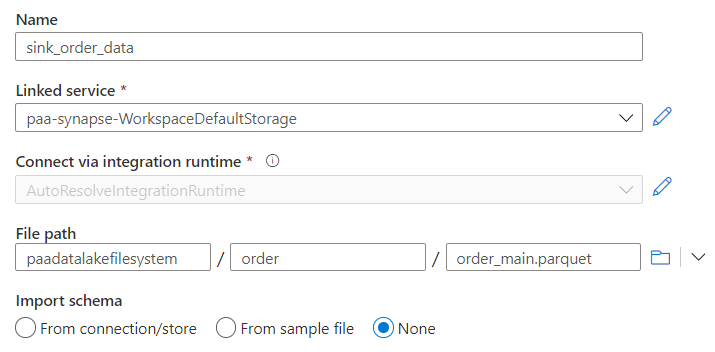

11. Click on the folder on the right of the "file path" section, then select the path in the data lake where you want to drop your data (double click on a folder to open it). You may choose the folder you created for the business process in previous steps.
12. If you wrote a query in the source section, also add the file name on the last text form of "File path" section, with ".parquet" as an extension. If you selected a table, leave it blank.

13. Click on the "Debug" button above to test the pipeline. **(NB: this will trigger the import and impute costs)** and verify if the pipeline runs successfully, in the output tab below

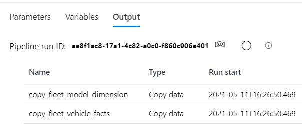

14. If the pipeline terminates correctly, verify if data retrieved are correct. Click on "Data" on the left, then on "Linked" tab, click on the primary data lake as in the image below. Then, navigate to the path you selected on the steps below

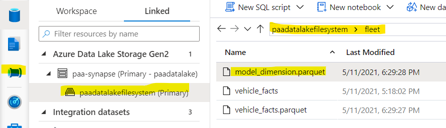

*Now we will create a view on the Data Lake*. 
*You may want to create external tables instead of of views. In this case, in next step select "Create an External Table" instead of SELECT TOP rows. Here an [analysis of the differences](https://www.jamesserra.com/archive/2020/11/external-tables-vs-t-sql-views-on-files-in-a-data-lake).*
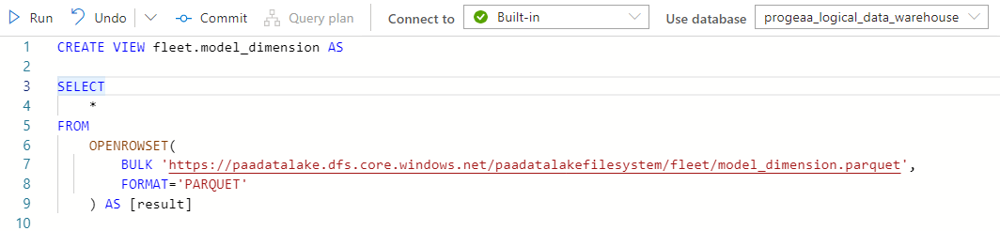

15. Right click on the file you created, and select "New SQL Script" --> Select TOP 100 Rows

16. Click on Run and verify if results are expected. 

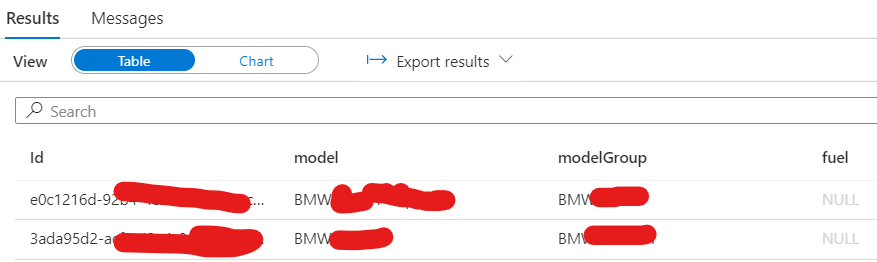

17. Now, modify the script removing the TOP 100 text and adding at the beginning "CREATE VIEW [name] AS", as in the figure below. Also, select the database you created in the [Preliminary steps](#preliminary-steps-and-creation-of-*logical-dwh*) at the right of *use database*, then click on "Run"

18. You may want to provide a name to the Script for creating the view (on the right bar), while this is not strictly necessary

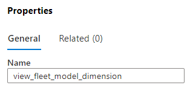

19. Click on "Validate all" tab above, and if the systems shows no errors, then click on "Commit All"

### Add trigger for the pipeline

You should now define triggers to schedule the activation of the pipeline. 

1. On the created pipeline, click on Add Trigger --> "New/Edit"

2. On the dropdown list, click on "New" *TODO: I think that if you already created a trigger for another pipeline, you can reuse it and avoid creating a new one. To verify.*
3. Create a new trigger providing all requested information. You may select "No" on activated to suspend the trigger and activate it later.

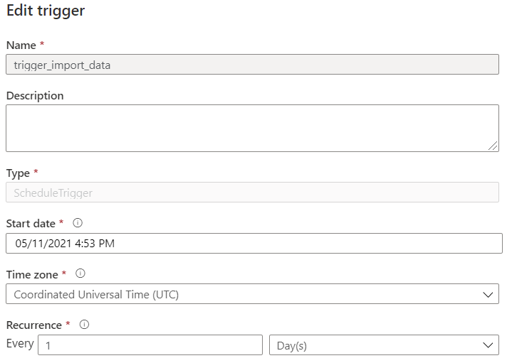

### Generate PowerBI Dashboards

1. Click on the paper icon on the left (develop), then click on Power BI datasets as in the figure, then click on New Power BI datasets

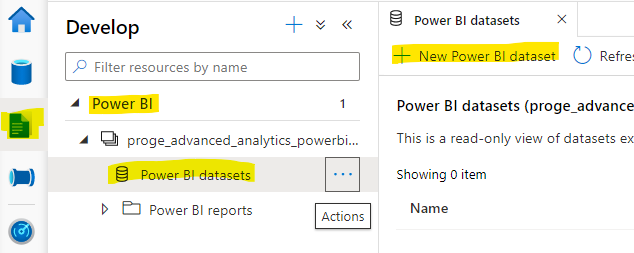

2. Download the PowerBI file, double click on it to open PowerBI

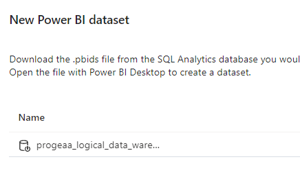

3. From PowerBI, connect with your Microsoft account

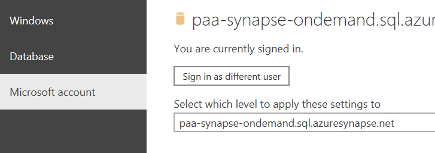

4. Select the views you created in the [Import data from external source](/PROGE-Advanced-Analytics-%2D-Wiki/Import-data-from-external-source) step and click on Load

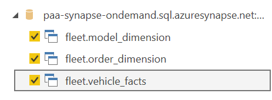

5. Select Direct Query or Import and validate
6. Verify the relationships in the correspondent view 
7. Prepare your analysis
8. When you finish, click on file --> publish and select the Workspace of Power BI created on previous step
9. You can now see the report in Synapse, in Develop tab

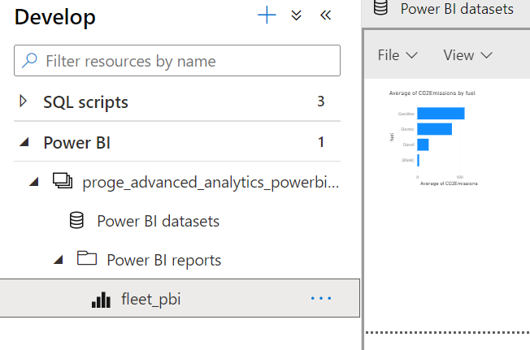

## Agenda

1. [Presentation](01.presentation.md) :clock12: **(00:00)**
2. [Introduction](02.introduction.md)
3. [Azure and microsoft resources](03.azure-microsoft-resources.md) :clock1230: **(00:30)**
4. **[Azure Synapse](04.azure-synapse.md) :clock1: (01:00)**
5. [Q&A](08.q&a.md) :clock2: **(02:00)**